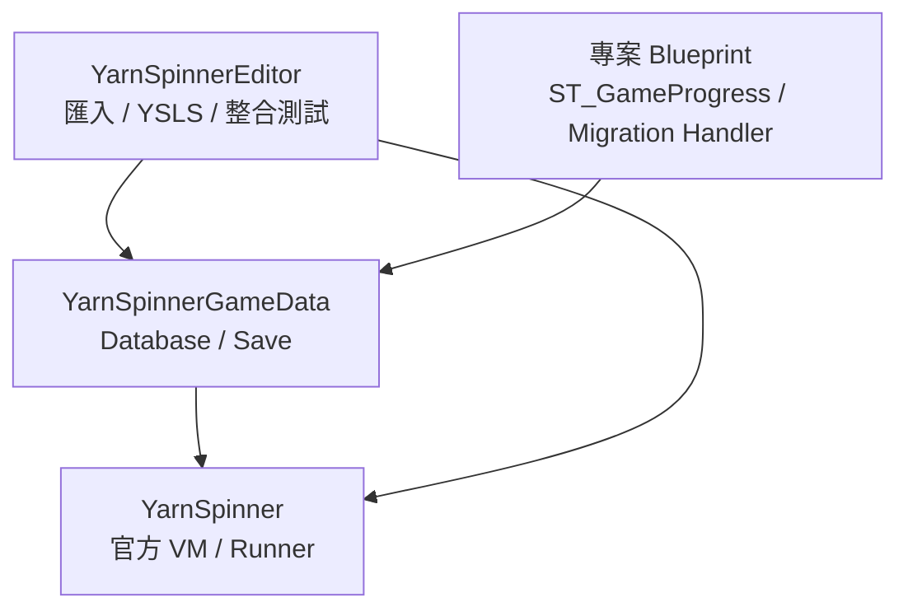
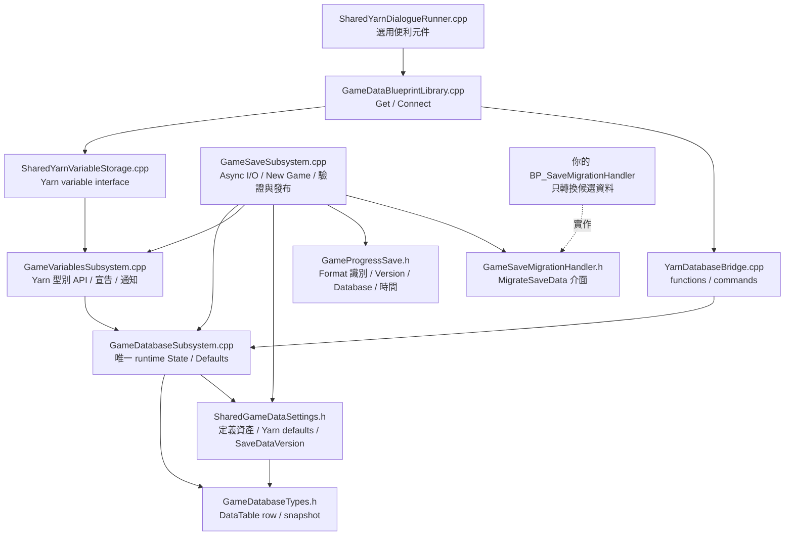
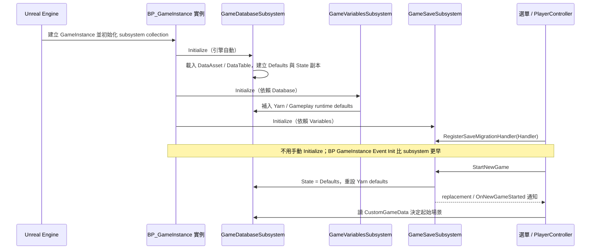
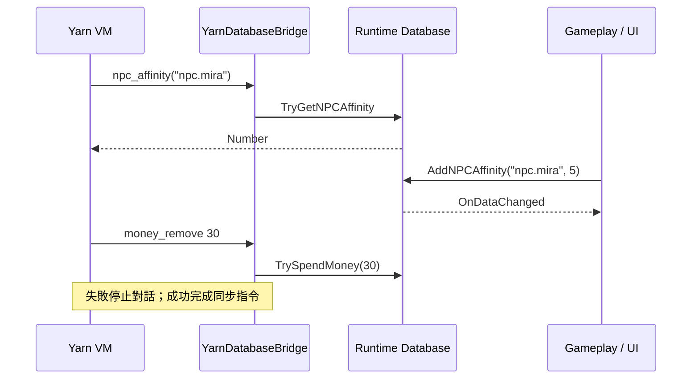
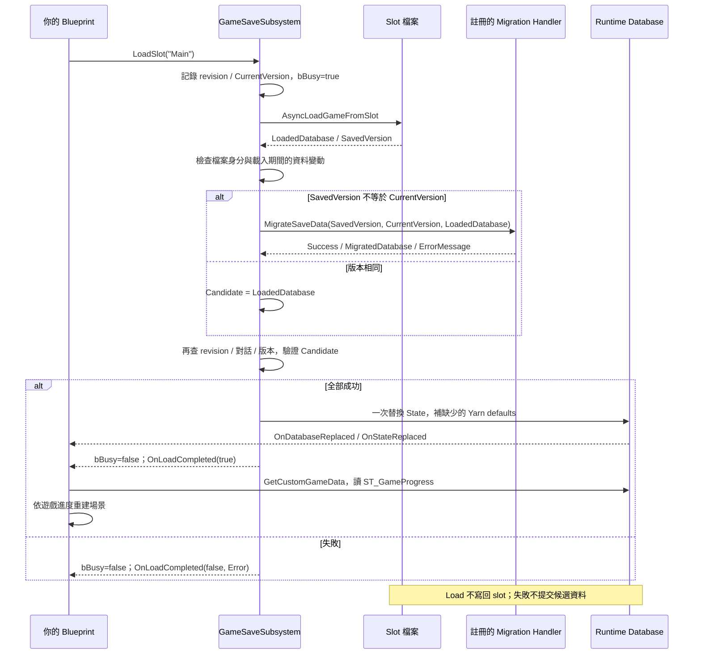

# Runtime Database、版本與 Blueprint 轉換流程

[Database 教學](DatabaseQuickStart.md) · [Migration handler 接法](SaveMigration.md)

## 模組與檔案依賴

下列檔案位於 Source/YarnSpinnerGameData，Public/*.h 定義 Blueprint API，Private/*.cpp 實作。

GameVariablesSubsystem 操作 Database.State.YarnVariables，沒有另一份值。CustomGameData 是你自訂的 ST_GameProgress；外掛不認識其中的日數、地圖或存檔點欄位。

## 初始化與新遊戲

Director BeginPlay → ConnectRunnerToSharedVariables → 註冊 storage、functions、commands → 才開始對話。New Game 不刪檔、不取消 handler、不自動開地圖。

## 對話與玩法

## 載入與 migration

沒有 handler 而版本不同會失敗。較高版本也交由 handler 決定是否支援。Handler 僅修改候選值；若自行修改 live data，revision 防護拒絕提交，但不回滾 handler 自行產生的副作用。

SaveSlot：複製呼叫當下的 Database + SaveDataVersion → AsyncSaveGameToSlot → OnSaveCompleted。StartingCheckpoint / CurrentCheckpoint / FGameCheckpoint 已移除，存檔位置與恢复入口均由 CustomGameData 決定。

## 測試入口

Source/YarnSpinnerEditor/Private/Tests/GameData：SharedGameDataTestCommandlet.cpp 包含 DatabaseChecks.inl 與 SaveMigrationChecks.inl。真實 Yarn VM、磁碟存讀、獨立 GameInstance、Blueprint Struct、實際編譯並執行的 Blueprint migration interface graph。

Scripts/TestGameData.ps1 檢查本次退出碼與新報告；Scripts/VerifyGameDataAPI.py 檢查反射 API 與既有 Blueprint 編譯。